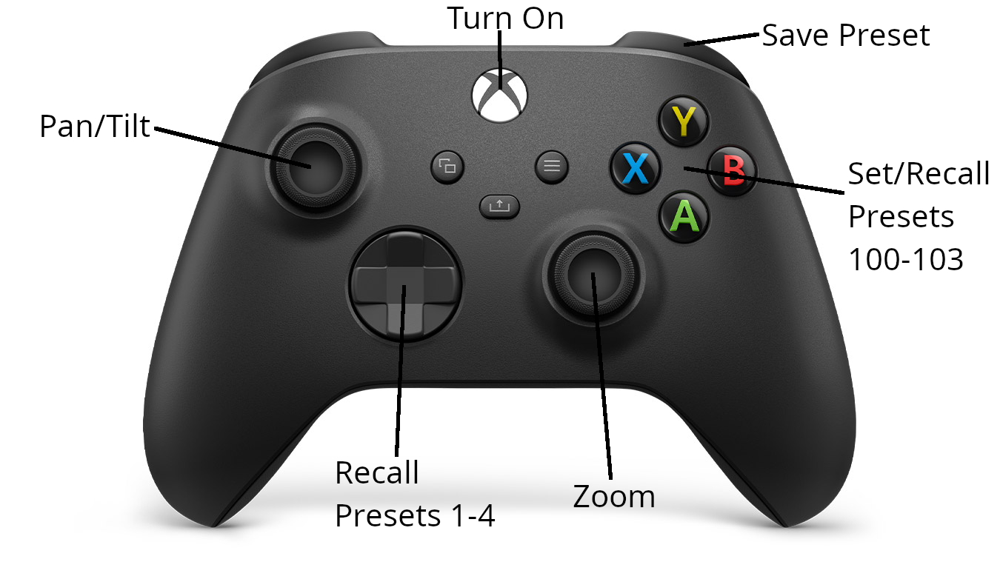

# XPTZController

Control your PTZ camera with a xbox controller.

**It is work in progress and will have errors.**

## Description

This project is a simple controller for PTZ cameras. It uses an ESP32 and an xbox Series X controller to control the camera. The camera is controlled via VISCA over RS-485.

It was tested with a [RGB20X/30X-POE-WH](https://www.rgblink.com/uppic/file/202112240532067028.pdf) camera from RGBlink. It should work with any camera that supports VISCA over RS-485.

## Features

- [x] Tilting
- [x] Panning
- [x] Zooming
- [x] Speed control
- [ ] Focus
- [x] Presets
- [ ] Save and load settings

## Controls

- Left Stick: Tilting and Panning
- Right Stick: Zooming
- D-Pad: Presets
- ABXY: Preset save and load
- RB: Set Preset
- Left Trigger: Save Preset on Press, Load Preset on Release
- XBOX: Turn on the camera

## Hardware

- ESP32 (I use a ESP32-C3 mini)
- ttl to rs485 converter
- PCB Screw Terminal Block Connector, or any other way to connect the RS-485 to the camera
- Xbox Series X controller

## Installation

1. Clone the repository
2. Open the project in PlatformIO
3. Select the correct board
4. Compile and upload the code

## Usage

1. Compile and flash the code to the ESP32.
2. Connect the RS485 Module to the ESP32.
3. Connect the RS485 Module to the camera.
4. Power on the ESP32.
5. Power on the camera.
6. Turn on the Xbox controller.

Now you should be able to control the camera with the Xbox controller.

If the Controller goes to sleep, you have to press the Xbox button to wake it up. It will automatically reconnect to the ESP32.

## Testing

Because I don't have a PTZ camera at home, I created a simple PTZ simulator. For development I recommend using https://sourceforge.net/projects/com0com/ to create a virtual serial port pair. Then you can use the simulator to test the controller.
It is a **very** simple Website under `/docs` or https://beniox.github.io/XPTZController .

## Libraries

I used the this library to control the xbox controller.

- [XboxSeriesXControllerESP32](https://github.com/asukiaaa/arduino-XboxSeriesXControllerESP32)

## Inpired by

- [arduino-VISCA-controller](https://github.com/foxworth42/arduino-VISCA-controller)
