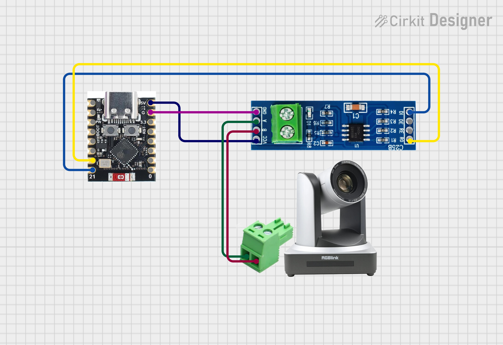

# XPTZController

Control your PTZ camera with a xbox controller.

**It is work in progress and will have errors.**

## Description

This project is a simple controller for PTZ cameras. It uses an ESP32 and an xbox Series X controller to control the camera. The camera is controlled via VISCA over RS-485.

It was tested with a [RGB20X/30X-POE-WH](https://www.rgblink.com/uppic/file/202112240532067028.pdf) camera from RGBlink. It should work with any camera that supports VISCA over RS-485.

## Features

- [x] Tilting
- [x] Panning
- [x] Zooming
- [x] Speed control
- [ ] Focus
- [x] Presets
- [ ] Save and load settings

## Hardware

- ESP32 (I use a ESP32-C3 mini)
- ttl to rs485 converter
- PCB Screw Terminal Block Connector, or any other way to connect the RS-485 to the camera
- Xbox Series X controller

## Usage

Currently there is no automatic way to pair the controller with the ESP32. You need to find the MAC address of the controller and set it in the code.

You also need to set the RS-485 pins in the code.

Then you have to compile and upload the code to the ESP32.

After powering up the ESP32, it will try to connect to the controller. If it is successful, you can start controlling the camera.

## Testing

Because I don't have a PTZ camera at home, I created a simple PTZ simulator. For development I recommend using https://sourceforge.net/projects/com0com/ to create a virtual serial port pair. Then you can use the simulator to test the controller.
It is a **very** simple Website under `/docs` or https://beniox.github.io/XPTZController .

## Libraries

I used the this library to control the xbox controller.

- [XboxSeriesXControllerESP32](https://github.com/asukiaaa/arduino-XboxSeriesXControllerESP32)

## Inpired by

- [arduino-VISCA-controller](https://github.com/foxworth42/arduino-VISCA-controller)
