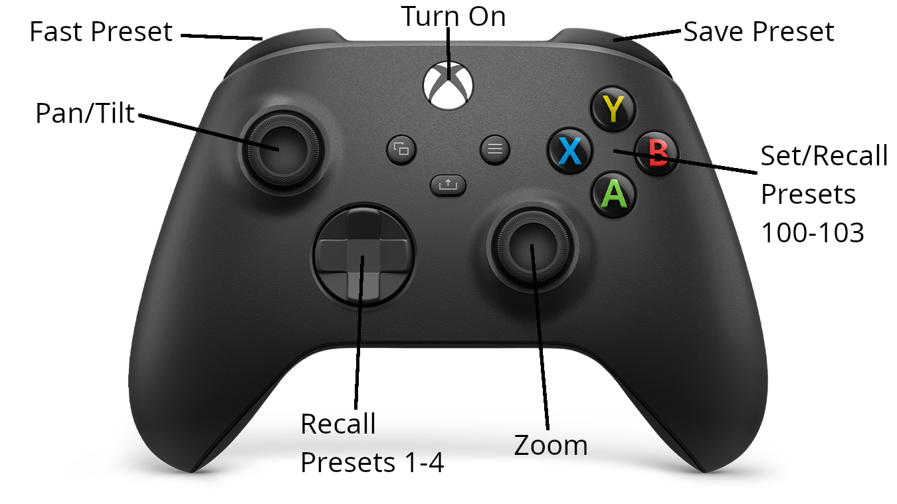

# XPTZController

Control your PTZ camera with an Xbox controller.

# Description

This project is a simple controller for PTZ (Pan-Tilt-Zoom) cameras using an ESP32 and an Xbox Series X controller. The camera is controlled via VISCA over RS-485, allowing for smooth and precise movements. It was tested with an [RGB20X/30X-POE-WH](https://www.rgblink.com/uppic/file/202112240532067028.pdf) camera from RGBlink and should work with any camera that supports VISCA over RS-485.


# Features

- [x] Tilting
- [x] Panning
- [x] Zooming
- [x] Speed control
- [ ] Manual Focus
- [x] Presets

# Controls



| Control      | Action                                       |
| ------------ | -------------------------------------------- |
| Left Stick   | Tilting and Panning                          |
| Right Stick  | Zooming                                      |
| D-Pad        | Presets                                      |
| ABXY         | Preset save and load                         |
| Right Back   | Set Preset                                   |
| Left Trigger | Save Preset on Press, Load Preset on Release |
| XBOX Button  | Turn on the camera                           |

# Installation

## Prerequisites

- ESP32 that supports BLE5 (ESP32-C3 or ESP32-S3 recommended)
- TTL to RS485 converter
- PCB Screw Terminal Block Connector or any other RS-485 to camera connection method
- Xbox Series X controller
- PlatformIO installed in your development environment

## Flashing

1. Clone the repository:

```sh
git clone https://github.com/beniox/XPTZController.git
```

2. Open the project in PlatformIO.
3. Select the correct board
4. Compile and upload the code to the ESP32.

## Hardware Setup

1. Connect the RS485 module to the ESP32.
2. Connect the RS485 module to the camera.
3. Power on the ESP32.
4. Power on the camera.
5. Turn on the Xbox controller.

# Usage

1. Compile and flash the code to the ESP32.
2. Connect the hardware components as described above.
3. Turn on the Xbox controller.

The controller should now be able to control the camera. If the controller goes to sleep, press the Xbox button to wake it up. It will automatically reconnect to the ESP32.

# Testing

If you don't have a PTZ camera available, you can use the PTZ simulator for testing.

Install [com0com](https://sourceforge.net/projects/com0com/) (Windows only) to create a virtual serial port pair.
Use the simulator available at /docs or at https://beniox.github.io/XPTZController to simulate the PTZ camera.

# Libraries

This project uses the following library to control the Xbox controller:

[XboxSeriesXControllerESP32](https://github.com/asukiaaa/arduino-XboxSeriesXControllerESP32)

<br>

# FAQ

### Q: Which ESP32 board should I use?

**A**: The code was tested with an ESP32-C3 and an ESP32-S3. Any ESP32 board that supports BLE5 should work.

### Q: How do I connect the RS485 module to the camera?

**A**: The connection method depends on the camera. The RGB20X/30X-POE-WH camera from RGBlink uses a 2-pin connector. You can use a PCB Screw Terminal Block Connector to connect the RS485 module to the camera.

### Q: How do I know if the camera supports VISCA over RS-485?

**A**: Check the camera's manual or contact the manufacturer. Most PTZ cameras support VISCA over RS-485.

### Q: How do I know if the camera is connected correctly?

**A**: Currently, the code does not have a way to check if the camera is connected. The easiest way to check is to move the camera and see if it responds.

### Q: How do I know if the Xbox controller is connected?

**A**: The The XBox logo is blinking when the controller is not connected. When the controller is connected, the XBox logo is solid.

### Q: The Controller is losing connection.

**A**: There are multiple reasons:

1. The ESP32 is too far away from the controller. Try moving the controller closer to the ESP32.

2. The Controller goes to sleep. Press the Xbox button to wake it up. It will automatically reconnect to the ESP32.

<br>

# Contribution

Contributions are welcome! If you have any suggestions, bug reports, or feature requests, feel free to open an issue or submit a pull request.

# License

This project is licensed under the MIT License. See the LICENSE file for details.
